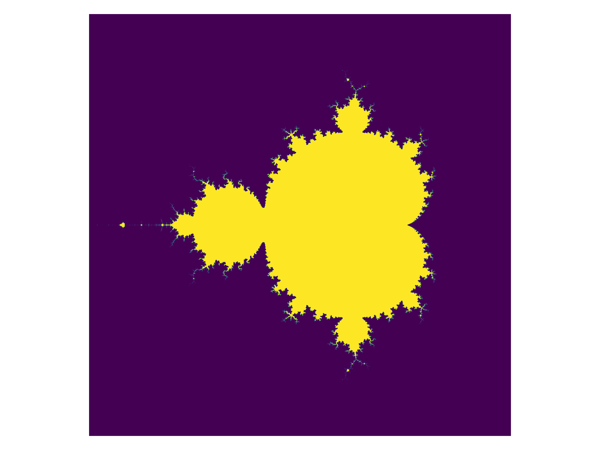
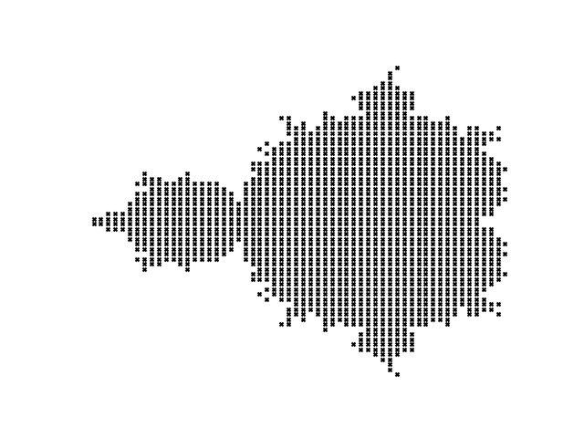

# Conjunto Mandelbrot

Dado um número complexo $\xi$, ele está no *conjunto de Mandelbrot* se a sequência recursiva
$$\boxed{
\begin{cases}
z_0 = 0\\
z_{n+1} = z_n^2 + \xi
\end{cases}
}$$
não diverge no infinito.



# Gerador Python

Em Python, a palavra-chave "yield" é usada no contexto de funções geradoras. Uma função geradora é uma função especial que retorna um objeto iterável, o qual pode ser percorrido sequencialmente. O "yield" é usado para pausar a execução da função geradora e retornar um valor temporariamente, sem encerrar completamente a função. Essa característica permite que a função seja retomada a partir do ponto onde foi pausada, mantendo seu estado interno.

# MeshGrid

Em python, para criar uma malha bidimensional de pontos, podemos definir o alcance de duas variáveis:

```python
x = np.linspace(-10, 10, 21)
y = np.linspace(0, 10, 11)

# x = [-10., -9., ..., 9., 10.]
# y = [0., 1., 2., ..., 9., 10.]
```

Imagine que queremos definir os pontos de tal forma que eles representem pontos do plano complexo:
$$\{a + bi : a\in x \text{ e } b\in y\}$$

Para isso vamos expandir ambos os arrays unidimensionais para arrays bidimensionais, replicando a mesma linha nas outras:

```python
X, Y = np.meshgrid(x, y)

# x = [[-10., -9., ..., 9., 10.],
#      [-10., -9., ..., 9., 10.],
#      ...
#      [-10., -9., ..., 9., 10.]]

# y = [[0, 0, ..., 0, 0],
#      [1, 1, ..., 1, 1],
#      ...
#      [10, 10, ..., 10, 10]]
```

De forma que ambos os arrays `X` e `Y` tem a dimensão: `X.shape == (y.size, x.size)`, ou seja, tem um número de linhas iguais ao número de elementos em `y` e um número de colunas iguais ao número de elementos em `x`.

Uma vez ambos foram criados, basta realizar:
```python
M = X + 1j*Y
```



---

# Referências

1. Real Python: Draw the Mandelbrot Set in Python. [Link](https://realpython.com/mandelbrot-set-python/)
2. Youtube, Numberphile: What's so special about the Mandelbrot Set? - Numberphile. [Link](https://youtu.be/FFftmWSzgmk)