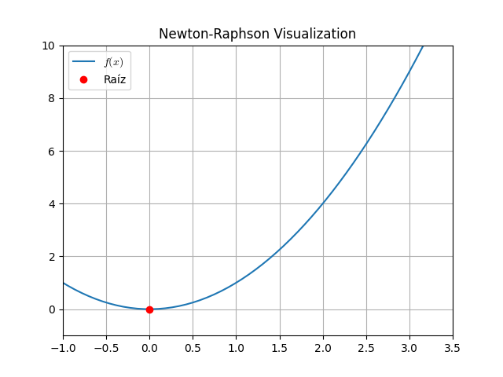
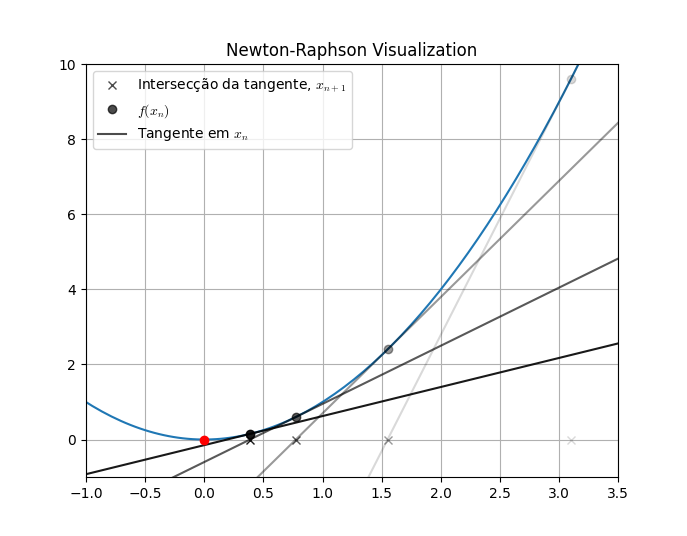

# Newton-Raphson Method

O método de Newton-Raphson para encontrar as raízes de uma função toma um palplite inicial $x_0$ e busca por soluções melhores de forma iterativa, a partir da fórmula

$$x_{n+1} = x_n - \frac{f(x_n)}{f'(x_n)}$$

Essencialmente, o método vai tomando passos pela reta tangente da função nas direções que a tangente intersecta a linha $y = 0$.

Por exemplo, dada a configuração:

Quando começamos em $x_0 = 3.1$, calculamos a reta tangente e obtemos que a intersecção dessa reta com $y=0$ é, aproximadamente, $x_1 = 1.6$. Tomando $x_1$ como ponto de partida, o procedimento se repete.

