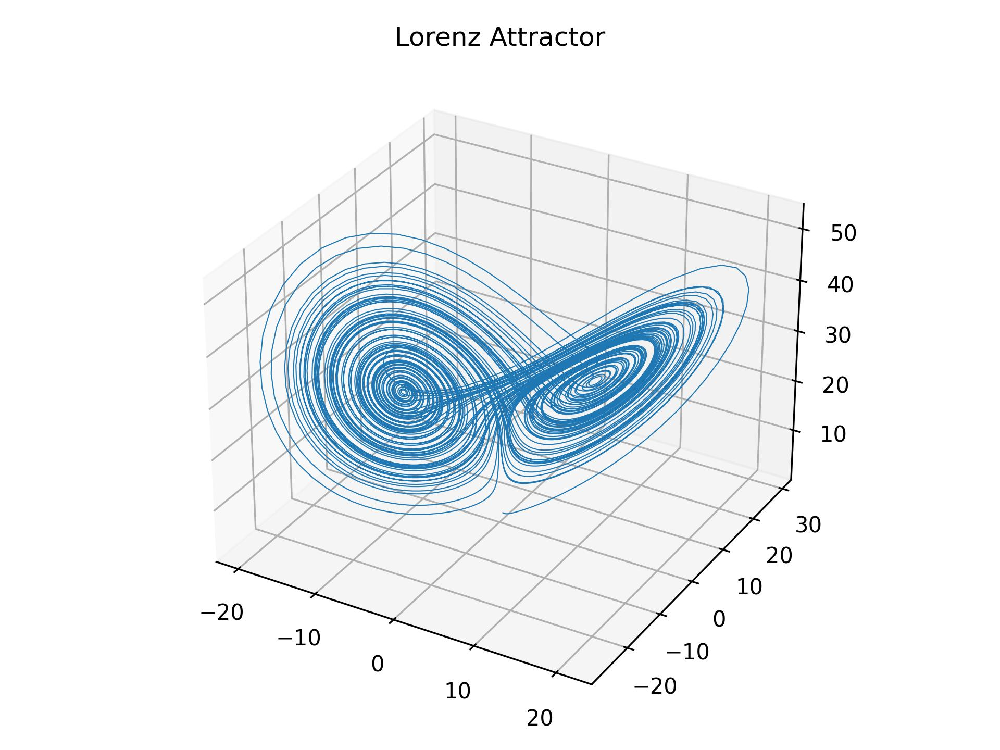
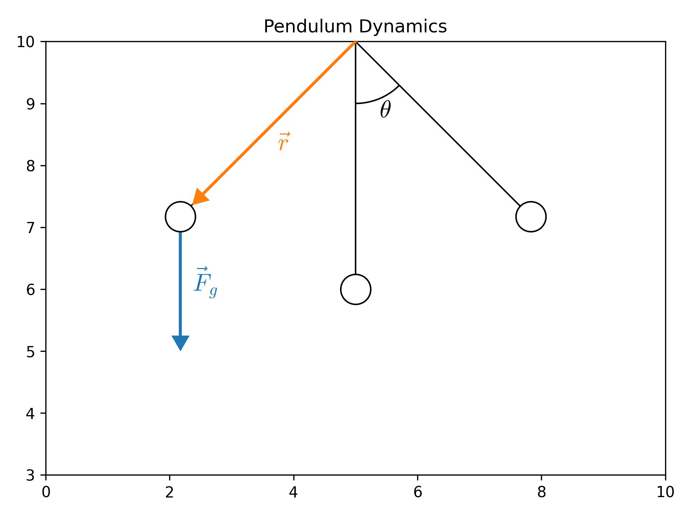
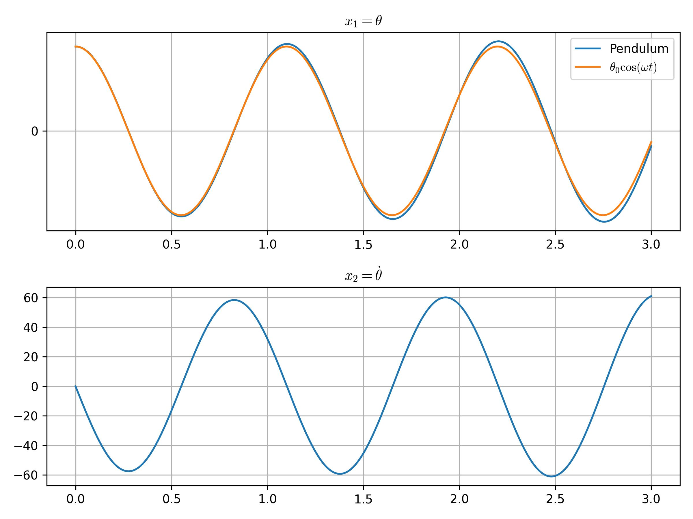
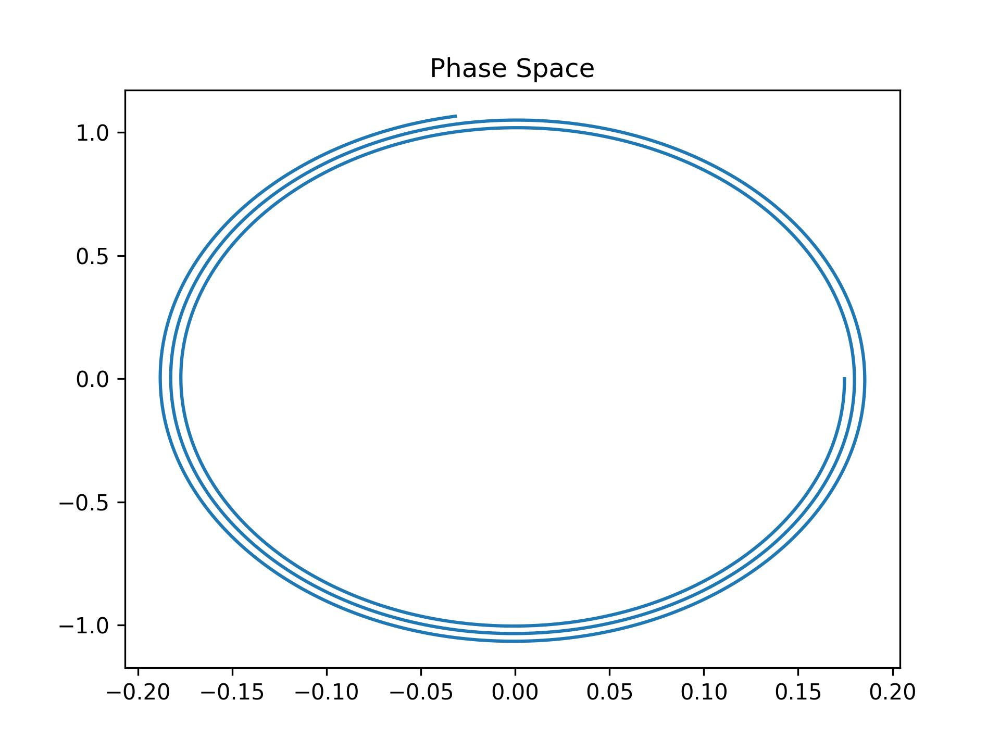
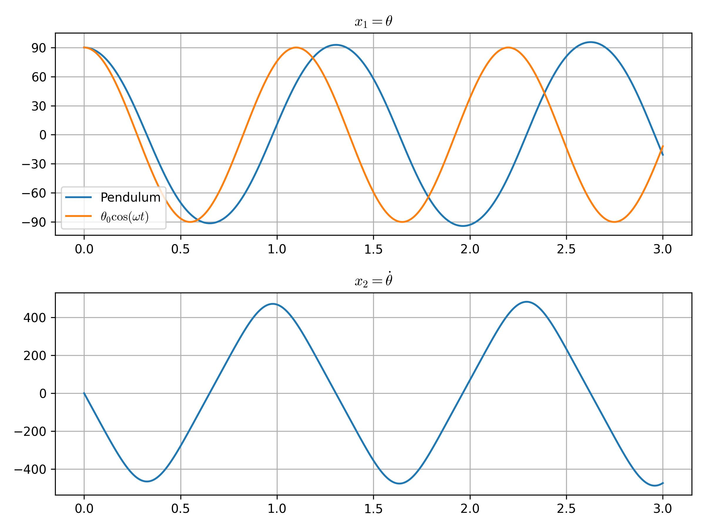
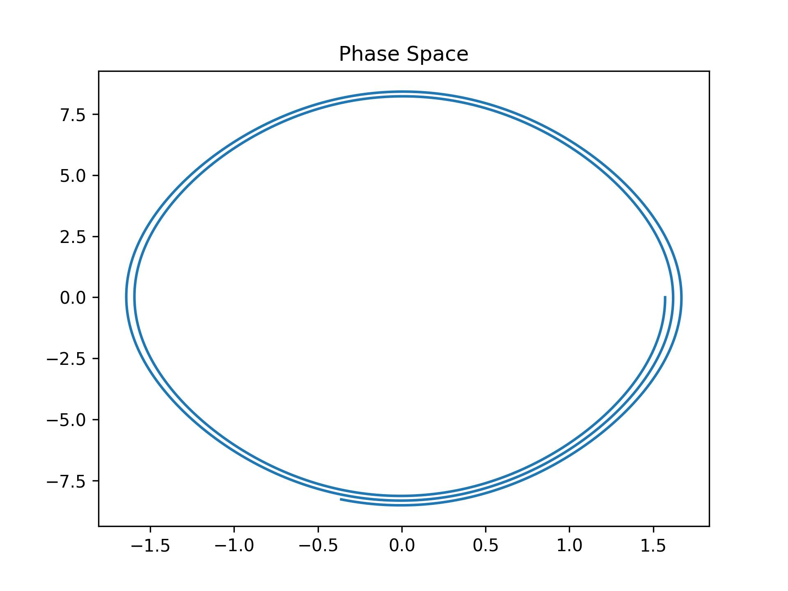
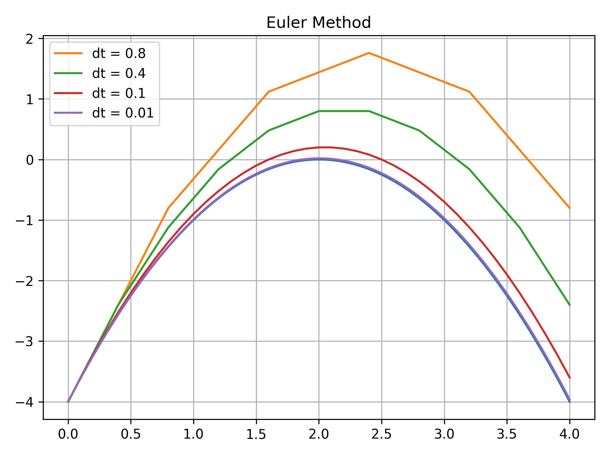

# Lorenz system

Em 1963, um modelo matemático simplificado da convecção atmosférica foi desenvolvido. O modelo consiste em um sistem de três equações diferenciais ordinárias, conhecidas como **equações de Lorenz**

$$
\begin{bmatrix}
    \dot{x} \\
    \dot{y} \\
    \dot{z}
\end{bmatrix} 
=
\begin{bmatrix}
    \sigma(y - x)\\
    x(\rho - z) - y\\
    xy - \beta z
\end{bmatrix}
$$

As equações relacionam as propriedades de uma camada de fluído bi-dimensional que é aquecida uniformemente pela parte de baixo e resfriado pela parte de cima. Em particular, as equações descrevem a taxa de variação temporal de três quantidades:
- $x$ é proporcional a taxa de convecção
- $y$ é a variação de temperatura horizontal
- $z$ é a variação de temperatura vertical

Além disso, o modelo apresenta as constantes $σ$, $ρ$, e $β$ que são parâmetros do sistema proporcionais ao número de Prandtl, número de Rayleigh e dimensões físicas da camada em si.

# Pendulum Dynamics

A dinâmica de um pêndulo simples pode ser descrita da seguinte maneira:

$$\tau = I\ddot{\theta}$$

Adotando a conveção que a orientação positiva de rotação é no sentido anti-horário: $(+, \circlearrowleft)$. Então quando o pêndulo está a um ângulo de $\theta$ da vertical, ele está sobre o efeito de um torque dado por:

$$\tau = -|r||F_g|\sin \theta$$

O sinal negativo resulta do fato do torque atuar no sentido horário $(-, \circlearrowright)$.

Como o tamanho da corda é $\ell$ e a massa do pêndulo é $m$, reescrevemos a equação como
$$-\ell (mg)\sin \theta = m\ell^2\ddot{\theta}$$
$$\boxed{\ddot{\theta}=-\frac{g}{\ell}\sin\theta}$$

Podemos transformar essa EDO de segunda ordem em um sistema de EDOs de primeira ordem, definindo $x_1 := \theta$ e $x_2 := \dot{\theta}$

$$
\begin{bmatrix}
    \dot{x}_1 \\
    \dot{x}_2 \\
\end{bmatrix} 
=
\begin{bmatrix}
    x_2\\
    -g/\ell \sin x_1\\
\end{bmatrix}
$$

Com condição inicial $\theta_0 = 10\degree$

e com $\theta_0 = 90\degree$

**Importante:** É possível ver que a amplitude da oscilação do pêndulo tende a aumentar com o tempo, violando a conservação de energia. Além disso, observe que as trajetórias no espaço de fase não são fechadas, sendo que na realidade, elas deveriam ser. Isso acontece por conta do **erro** acumulado do método.

# Euler Method

O método de Euler é um procedimento numérico para resolver uma equação diferencial ordinária de primeira ordem com condição inicial dada. É um método explícito e é o mais simples dos métodos de Runge-Kutta. Recebeu o nome por conta do trabalho publicado por Euler "Institutionum calculi integralis".

## Purpose and Why it Works

Considere o problema de calcular o formado de uma dada curva que começa em um ponto e satisfaz uma equação diferencial dada. Aqui, a equação diferencial é uma fórmula que fornece a inclinação da reta tangente a curva em cada ponto.

A ideia consiste em tomar um passo de tamanho fixo baseado na reta tangente a curva. Uma vez que o passo foi dado e um novo ponto foi alcançado, repete-se o processo assumindo que o ponto atual está sobre a curva e a reta tangente é dada pela mesma equação diferencial.  
 

## First Order Process

Dadas as condições inicias $t_0$ e $y(t_{0})$, e a derivada de $y$ é uma função de $t$ e $y$ descrita como $y'(t)=f{\bigl (}t,y(t){\bigr )}$. Então o processo pode ser sintetizado pela expressão recursiva:

$$y_{n+1}=y_{n}+hf(t_{n},y_{n}).$$

Sendo $y_{n}$ uma aproximação para a expressão $y$ no tempo $t_{n}$, i.e., $y_{n}\approx y(t_{n})$.

Como dito, o método de Euler é **explícito**, ou seja, dadas as condições anteriores, o próximo ponto pode ser calculado de forma direta.

## Higher-order process

Enquanto o método de Euler integra uma equação ordinária de primeira ordem, qualquer ODE de ordem $n$ pode ser representada como um sistema de múltiplas equações de primeira ordem. Dada uma equação de ordem $n$ como

$$\frac{d^nx}{dt^n} = f\left(t,x,\frac{dx}{dt}, ...,\frac{d^{n-1}x}{dt^{n-1}}\right)$$

Pode ser reescrita como

$$\mathbf{\dot{x}} = \mathbf{f}(t, \mathbf{x})$$

Veja o exemplo do pêndulo.

___

# Referências

1. Wikipedia, Lorenz system .[Link](https://en.wikipedia.org/wiki/Lorenz_system)
2. Wikipedia, Pendulum (Mechanics). [Link](https://en.wikipedia.org/wiki/Pendulum_(mechanics))
3. Curso de Cálculo Númerico, Prof. Biloti (Unicamp). [Link](https://www.ime.unicamp.br/~biloti/an/211/edo-01.html)
4. Wikipedia, Euler Method. [Link](https://en.wikipedia.org/wiki/Euler_method)